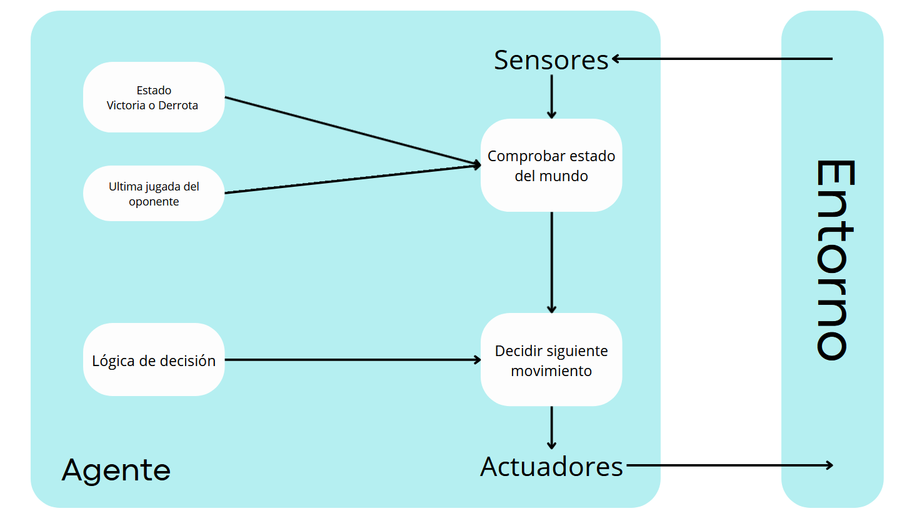

# Piedra-Papel-Tijera
## 1.Especificación do contorna de tarefas
Contorno de tarefas | Observable| Axentes | Determinista | Episódico | Estático | Discreto | Coñecido
:---: | :---: | :---: | :---: | :---: | :---: | :---: | :---: |
 RPS | Parcialmente | MultiAgente | No Determinista | Secuencial | Estático |  Discreto |  Coñecido |
 ### Explicación de las carácteristicas del entorno
 #### **Observable**
 Se considera que el entorno es **parcialmente observable**, porque el agente no puede saber la opción que sacara el rival.
 #### **Agentes**
 Se trata de un entorno de **MultiAgentes**, ya que el número mínimo de jugadores debe ser 2 en adelante.
 #### **Determinista**
 El RPS es **No-Determinista** porque no está determinada la opción que se usará en cada turno según el turno anterior. Podemos plantear una estrategia y tener cierta idea de qué es más o menos probable, pero nunca será seguro al 100%
 #### **Episódico**
 De la misma manera que ha sido explicado por qué RPS es **No-Determinista** puede decirse que es **Secuencial** ya que no hay una opción que defina el siguiente movimiento del agente. 
 #### **Estático**
 Se define como un entorno **Estático** debido a que el estado del mundo no cambia hasta que se toma una decisión.
 #### **Discreto**
 Es **Discreto**, porque las posibles opciones son limitadas, al igual que las combinaciones de estados.
 #### **Conocido** 
 En el juego de RPS todos los agentes conocen sus reglas para poder jugarlo, se trata de un mundo pequeño sin posibilidad de descubrir nuevas reglas a medida que juegas.

 ## 2.Identificación del tipo de agente y estructura
 El tipo de agente utilizado para este proyecto será un **agente reactivo basado en un modelo** (Indicado en el punto 2.4.3 del libro "Artificial Intelligence a Modern Approach). Esto se debe a que en la implementación del código se guardaran dos variables goblales para que el agente tome decisiones, se tratan de la variable `result` que guarda si el agente ganó o perdió y `last_user_action` que recoge la ultima acción usadab por el adversario. El agente sigue la lógica explicada en este video [Cómo ganar SIEMPRE jugando a Piedra, Papel o Tijera](https://www.youtube.com/watch?v=i0_Y0ll6Z08). 

 

 **Diagrama del agente**

 * Estado Victoria o Derrota: Según el modelo del agente, es necesario comprobar cúal fue el desenlace de la partida, ya que ello determinará cual será su via de decisión para escoger su próximo movimiento.
 * Ultima jugada del oponente: Es importante poder almacenar esta información ya que la lógica seguida recae de forma muy importante en que jugó el adversario el turno anterior para así poder adelantarse .
 * Lógica de decisión: Esta será la parte donde todos los elementos anteriores se tienen en cuenta y el agente decide que movimiento realizará en la ronda siguiente.

## 3.Proceso de instalación
 * Crear una carpeta donde almacenar el repositorio y colocarnos en él.
   ```
   mkdir <nombre de la carpeta>
   cd <nombre de la caperta
   ```
 * Clonar el repositorio mediante el enlace de github que se encuentra en `code` en el apartado `https`.
   ```
   git clone <url del repositorio>
   ```
 * Colocarse en la carpeta `Piedra-Papel-Tijera/src/main`y iniciar el programa.
   ```
   cd Piedra-Papel-Tijera/src/main/
   python3 RPS.py
   ```
   
    
 

