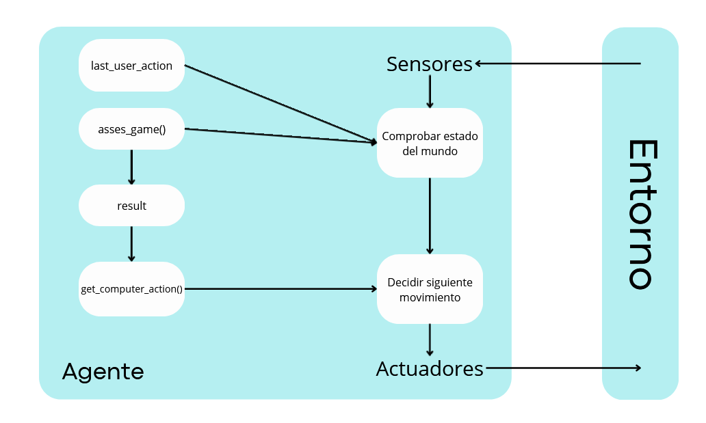

# Piedra-Papel-Tijera
## 1.Especificación do contorna de tarefas
Contorno de tarefas | Observable| Axentes | Determinista | Episódico | Estático | Discreto | Coñecido
:---: | :---: | :---: | :---: | :---: | :---: | :---: | :---: |
 RPS | Parcialmente | MultiAgente | No Determinista | Secuencial | Estático |  Discreto |  Coñecido |
 ### Explicación de las carácteristicas del entorno
 #### **Observable**
 Se considera que el entorno es **parcialmente observable**, porque el agente no puede saber la opción que sacara el rival.
 #### **Agentes**
 Se trata de un entorno de **MultiAgentes**, ya que el número mínimo de jugadores debe ser 2 en adelante.
 #### **Determinista**
 El RPS es **No-Determinista** porque no está determinada la opción que se usará en cada turno según el turno anterior. Podemos plantear una estrategia y tener cierta idea de qué es más o menos probable, pero nunca será seguro al 100%
 #### **Episódico**
 De la misma manera que ha sido explicado por qué RPS es **No-Determinista** puede decirse que es **Secuencial** ya que no hay una opción que defina el siguiente movimiento del agente. 
 #### **Estático**
 Se define como un entorno **Estático** debido a que el estado del mundo no cambia hasta que se toma una decisión.
 #### **Discreto**
 Es **Discreto**, porque las posibles opciones son limitadas, al igual que las combinaciones de estados.
 #### **Conocido** 
 En el juego de RPS todos los agentes conocen sus reglas para poder jugarlo, se trata de un mundo pequeño sin posibilidad de descubrir nuevas reglas a medida que juegas.

 ## 2.Identificación del tipo de agente y estructura
 El tipo de agente utilizado para este proyecto será un **agente reactivo basado en un modelo** (Indicado en el punto 2.4.3 del libro "Artificial Intelligence a Modern Approach). Esto se debe a que en la implementación del código se guardaran dos variables goblales para que el agente tome decisiones, se tratan de la variable `result` que guarda si el agente ganó o perdió y `last_user_action` que recoge la ultima acción usadab por el adversario.Además, se añade la clase `GameComputerResult` que sirve para acceder al estado de la ultima partida acabada. 
 ### Lógica empleada para el agente:
La lógica utilizada toma como base el estudio estadístico del RPS realizado a lo largo de los años. Según este estudio, se utilizará papel como primera opción siempre, debido a que el movimiento de entrada más empleado es piedra, resultando nuestra acción como la más segura. A continuación se diseccionarán los 3 estados posibles que el RPS puede tener, **Victoria**,**Derrota** y **Empate**.
La aplicación de este estudio sería la siguiente:

+ **Victoria:** Si el agente gana, imitará la acción realizada por el usuario en esa ronda, puesto que, el pensamiento humano es que si un movimiento nos dió la derrota, es buena opción cambiar al movimiento que dé la victoria a la acción que nos ganó. Por lo tanto escoger la acción del usuario daría al agente la victoria debido al limitado numero de opciones.
  
+ **Derrota:** Si el agente pierde, utilizará el movimiento que gane al anterior utilizado por el usuario. Esto se debe a que según los estudios, las personas tienden a repetir el movimiento que les dió la victoria.
  
+ **Empate:** En caso de empate, no se tomará ninguna estadística en cuenta, si no que se decidirá aleatoriamente un movimiento ya que dependiendo de la persona, puede tomarse un empate como una no-victoria o una no-derrota, lo que provoca que se aplique cualquiera de las dos logicas comentadas anteriormente.

  La lógica explicada ha sido extraida del siguiente video: [Cómo ganar SIEMPRE jugando a Piedra, Papel o Tijera](https://www.youtube.com/watch?v=i0_Y0ll6Z08). 

**Diagrama del agente**

### [Explicación del diagrama del agente:](#diagrama)
 * **asses_game()**: Mediante esta función se indica cuál fue el resultado de la partida y devuelve uno de los tres posibles valores: `Lose`, `Win` o `Draw`.
  * **get_computer_action()**: Función por la cual el agente decidirá cuál será su siguiente movimiento, para ello utilizará tanto `result` como `last_user_action`
 * **last_user_action**: Variable global, la cual almacena el último movimiento realizado por el usuario.
 * **result**: Variable global, que almacena cuál fue el resultado de la partida anterior
## 3.Proceso de instalación
 * Crear una carpeta donde almacenar el repositorio y colocarnos en él.
   ```
   mkdir <nombre de la carpeta>
   cd <nombre de la caperta
   ```
 * Clonar el repositorio mediante el enlace de github que se encuentra en `code` en el apartado `https`.
   ```
   git clone <url del repositorio>
   ```
 * Colocarse en la carpeta `Piedra-Papel-Tijera/src`y iniciar el programa.
   ```
   cd Piedra-Papel-Tijera/src/
   python3 RPS.py
   ```
   
    
 # Piedra-Papel-Tijera-Lagarto-Spock
 La lógica implementada es la misma que la usada en el RPS normal con la principal diferencía de que en el caso de perder, como las opciones se amplian a elegir entre 2, **el oponente saca piedra y nosotros sacamos tijeras, nuestra decisión ya no es como en el RPS normal,en el que sacariamos papel, si no que aquí dispondríamos de PAPEL y SPOCK por lo tanto es un 50% de probabilidades. Por ello insertamos un random que genera una de las 2 opciones posibles y así continuar con el juego** 
 
## 3.Proceso de instalación
 * Crear una carpeta donde almacenar el repositorio y colocarnos en él.
   ```
   mkdir <nombre de la carpeta>
   cd <nombre de la caperta
   ```
 * Clonar el repositorio mediante el enlace de github que se encuentra en `code` en el apartado `https`.
   ```
   git clone <url del repositorio>
   ```
 * Colocarse en la carpeta `Piedra-Papel-Tijera/src`y iniciar el programa.
   ```
   cd Piedra-Papel-Tijera/src/
   python3 RPSLS.py
   ```
